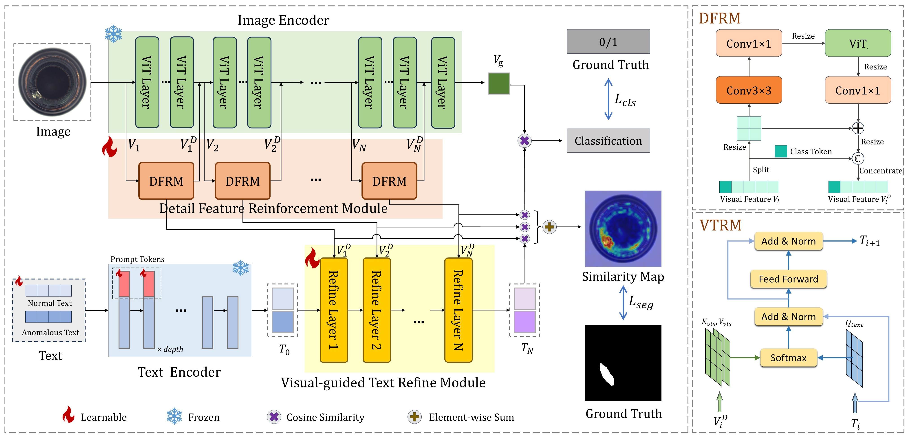

# DDE-CLIP: Detail-Guided Dual-Modal Enhancement for Zero-Shot Anomaly Detection
[CIKM'25] DDE-CLIP: Detail-Guided Dual-Modal Enhancement for Zero-Shot Anomaly Detection

## Introduction
Zero-shot Anomaly Detection (ZSAD) is an emerging task in industrial settings. It aims to detect anomalies in a target dataset without training samples, which is crucial for sample scarcity and data privacy. Existing methods largely rely on CLIP, leveraging its internal knowledge to detect anomalies. However, due to its pre-training on natural image-text pairs, CLIP suffers from domain shift, favoring global semantics over fine-grained defect detection in industrial images. Furthermore, most existing methods employ fixed text prompt to guide the model, which is difficult to describe diverse and unseen anomalies, leading to poor accuracy. To address these limitations, we propose a Detail-guided Dual-modal Enhancement Model (DDE-CLIP) for the ZSAD task. Firstly, we designed the Detail Feature Reinforcement Module (DFRM) to capture local representations of minute defects. Its specialized design effectively enhances the model’s perception of fine-grained anomalies and enables the pre-trained CLIP model to better adapt to the unique visual characteristics of industrial images. Subsequently, we introduced the Visual-guided Text Refinement Module (VTRM), which can dynamically optimize text prompts based on the input image's visual content (particularly the detail features captured by DFRM). This ensures the accurate reflection of text prompts on specific semantics of various defects, thereby significantly enhancing the alignment between vision and text for unseen anomalies. Overall, our DDE-CLIP uses detail features to enhance both image and text modalities, effectively addressing the challenges of ZSAD. Extensive experiments on 7 real-world industrial product datasets demonstrate that DDE-CLIP exhibits superior detection and localization capabilities compared to other methods.

## Overview


### Prepare Dataset
Download the dataset and put them in ./data/:

[MVTec](https://www.mvtec.com/company/research/datasets/mvtec-ad), [VisA](https://github.com/amazon-science/spot-diff), [MPDD](https://github.com/stepanje/MPDD), [SDD](https://www.vicos.si/resources/kolektorsdd/), [RAD](https://drive.google.com/drive/folders/14sTEtptHbhECPbd7WyhpvtR9BA4YdjCP), [CID](https://drive.google.com/drive/folders/1JW2-_LsmwQkYQkZ23zLAD124ZGNOAtkA), [3CAD](https://drive.google.com/file/d/1BIX0H8TZp0wmrAnXPw8_aCAIX1j1Fzwz/view)

Generate dataset json:
```bash
python generate_dataset_json/mvtec.py
```

### Download Pretrained Weight
 Download the CLIP weights pretrained by OpenAI [[ViT-L-14-336.pt](https://openaipublic.azureedge.net/clip/models/3035c92b350959924f9f00213499208652fc7ea050643e8b385c2dac08641f02/ViT-L-14-336px.pt)] to ./pretrained_weights/

### Create Environments
```bash
conda create -n dde python=3.9
conda activate dde
pip install -r requirements.txt
```


### Train
You can train your own weight:
```bash
bash train.sh
```

### Test
```bash
bash test.sh
```


* We thank for the code repository: [AnomalyCLIP](https://github.com/zqhang/AnomalyCLIP/tree/master).
